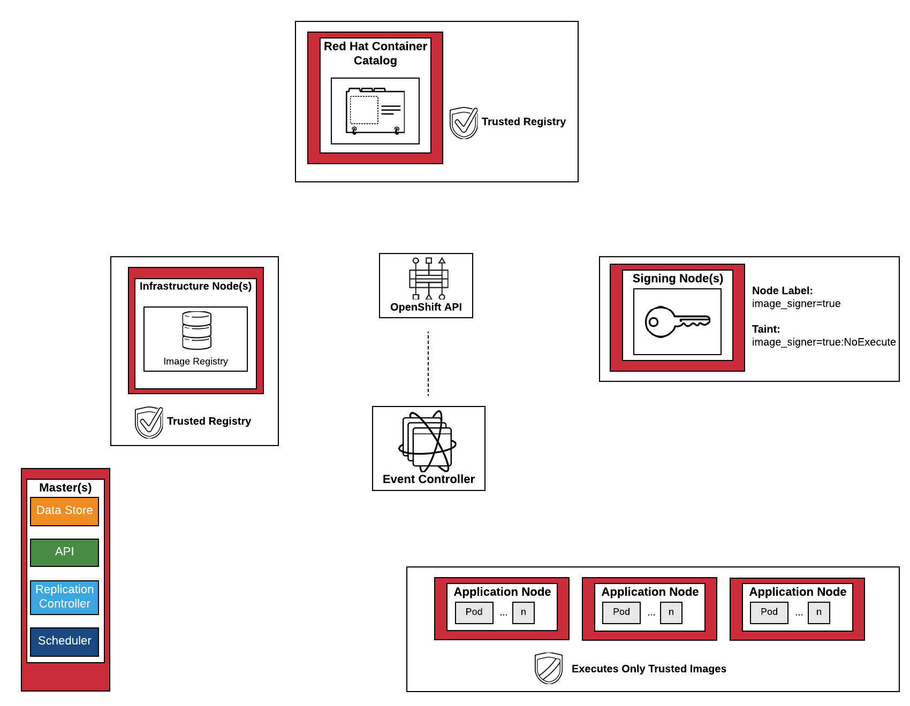
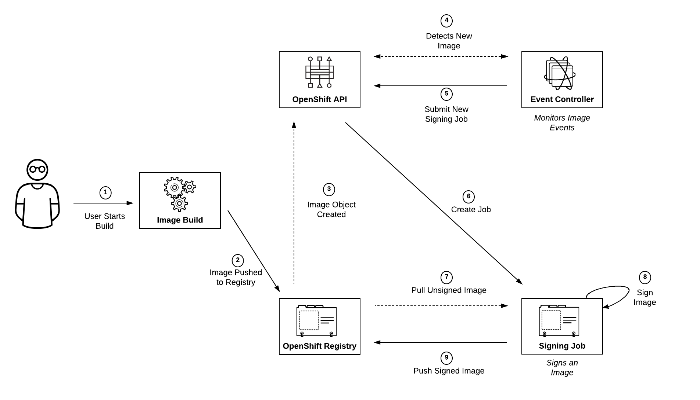
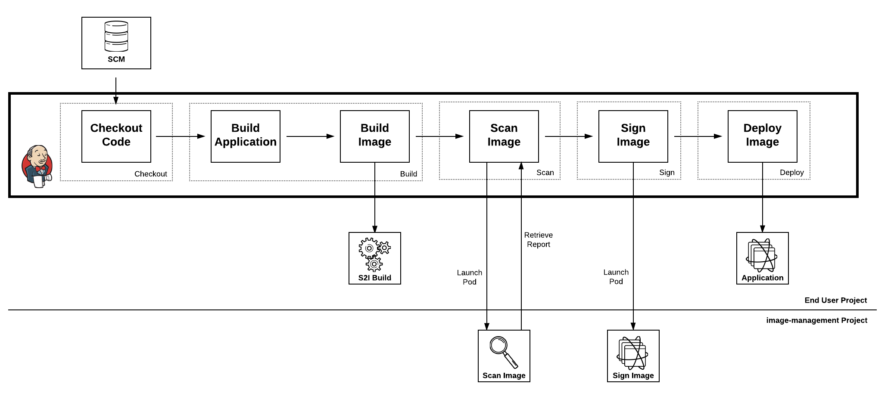

OpenShift Container Platform Image Signing and Image Scanning
========================================

_This repository is currently undergoing active development. Functionality may be in flux_

## Overview

The OpenShift Container Platform ecosystem contains mechanisms for securely managing container images. This includes but is not limited to [image signing](https://docs.openshift.com/container-platform/3.6/admin_guide/image_signatures.html) and [image scanning](https://docs.openshift.com/container-platform/3.6/security/container_content.html#security-content-scanning).

A set of Ansible tools is available to aid in the automation and configuration of the target environment.

## Concepts

### Image Signing

Image signing is a way to apply a digital signature to a container image. This guide describes how an automated process can be created an implemented within OpenShift. The goal is to produce an environment that allows for only the execution of signed images from trusted sources (Red Hat Container Catalog [RHCC]) along with assets that are created within an organization or group.  

### Image Scanning

Image scanning is a process for inspecting the composition of a container image for vulnerabilities or threats. While there are a number of tools on the market today, this guide will describe how image scanning can be utilized to verify the content of images prior to their deployment into a production environment. 

## Infrastructure as Code (IaC) and Automation

Infrastructure as Code (IaC) is a concept representing computer systems through programming constructs instead of of physical hardware. When used in combination with automation tools, such as Ansible, it provides the ability to repeatably apply components in a rapid manner.  

## Architectures

Two architectures will be presented in order to highlight the concepts of image signing and image scanning:

1. Automated image scanning leveraging the [controller](https://kubernetes.io/docs/reference/generated/kube-controller-manager/) pattern. Images that are built on the OpenShift platform are automatically scanned as they are pushed to the integrated Docker registry.
2. Inclusion of image signing and image scanning as part of a Continuous Integration and Continuous Delivery (CI/CD) pipeline. 

### Common Themes

Both architectures utilize a typical OpenShift environment by specifying dedicated nodes for performing image management actions. The key difference between image management nodes and the rest of the nodes in the environment is relaxing the image requirement policies to allow for signing actions to occur on these nodes. 

Two ways to ensure only image management workloads are scheduled onto these dedicated nodes is through [Node Selectors](https://docs.openshift.com/container-platform/latest/admin_guide/scheduling/node_selector.html#admin-guide-sched-selector-config) placed on image management resources and [tainting](https://docs.openshift.com/container-platform/latest/admin_guide/scheduling/taints_tolerations.html) image management nodes. Image management resources are configured with tolerations to allow execution on the tainted nodes.

### Automated Scanning using the Controller Pattern

Deployment of a controller which monitors the OpenShift API at a cluster level. When an image is pushed to the integrated Docker registry, a process is initiated to sign the image with a previously configured assets configured within the environment. Images will be forbidden from executing within the environment until it has undergone a signing action either from the event controller process or have originated from a trusted container registry (Red Hat Container Catalog).  





### Image Scanning and Signing Continuous Integration and Continuous Delivery Pipeline

Implementation of image scanning and image signing as part of a Continuous Integration and Continuous Delivery (CI/CD) process using the Jenkins pipeline as code concept. Source code is retrieved from a source code management tool which is then compiled and packaged into an artifact. The artifact is packaged into a Docker image through the execution of the [Source-To-Image](https://docs.openshift.com/container-platform/latest/architecture/core_concepts/builds_and_image_streams.html#source-build) build process. Once complete, the resulting image is scanned for vulnerabilities. The end user is provided the ability to review the results of the scan and decide whether to continue or abort the pipeline. If approved, the image is signed using the tools previously configured in the environment and then is ultimately deployed. 



## Setup and Configuration

A set of Ansible playbooks and roles is available to automate the configuration of an OpenShift environment for the tooling provided by here. The following are actions which are performed in the automation tooling:

* Creation of GPG keys
* Configuration of OpenShift host machines to enable signature verification along with trusted sources
* Deployment of OpenShift cluster resources to host image signing resources
* Building a base image containing tooling to perform image signing and image scanning tasks
* Deployment of the image signing event controller if the controller pattern is chosen
* Deployment of the assets to support 

### Ansible Automation


#### Inventory File Configuration

The inventory file is broken down into 3 (three) host groups:

* gpg - Machine responsible for creating GPG keys
* image_managers - OpenShift nodes responsible for signing images
* masters - OpenShift masters. At least one host is required in order to execute actions using the OpenShift API
* nodes - All OpenShift nodes

#### Playbook Execution

The OpenShift environment can be configured by executing the `image-signing-scanning-setup.yml` playbook in the `ansible/playbooks` folder.

By default, the _Image Scanning and Signing Continuous Integration and Continuous Delivery Pipeline_ architecture is deployed. To instead deploy the _Automated Scanning using the Controller Pattern_ architecture, set the `deploy_eventcontroller=false` inventory variable.

When ready, execute the following command from within the _playbooks_ directory to initiate the setup:

```
ansible-playbook -i hosts image-signing-scanning-setup.yml
```

Once the playbook completes, the OpenShift environment will be configured to handle image scanning, signing and execution.
